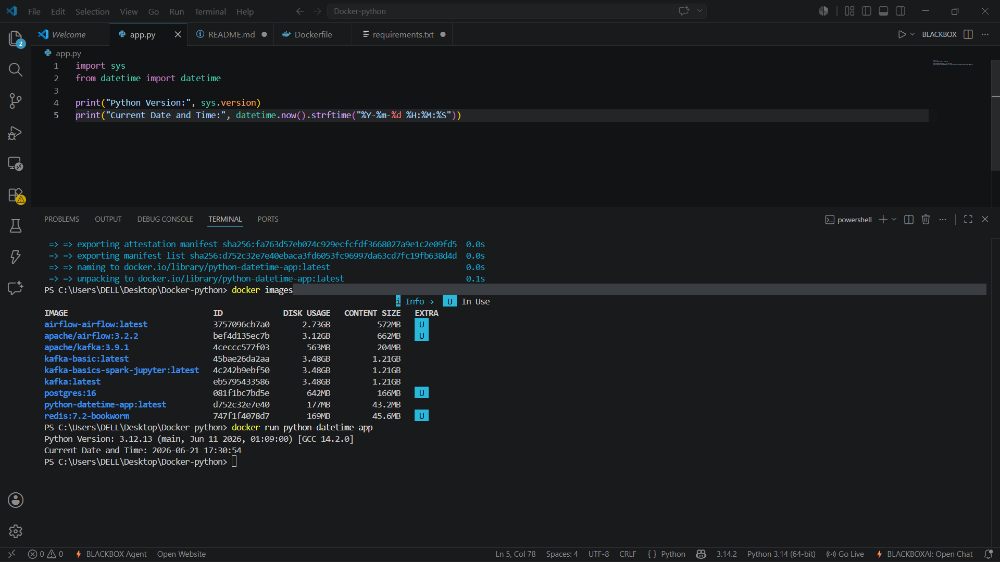

# Assignment 15 - Dockerized Python Application

## Overview

This project demonstrates a Dockerized Python application using the `python:3.12-slim` base image.

The application prints:

* Current Python Version
* Current Date and Time

## Project Files

* app.py
* Dockerfile
* requirements.txt
* README.md
* Screenshot.png

## Build Docker Image

```bash
docker build -t python-datetime-app .
```

## Run Docker Container

```bash
docker run python-datetime-app
```

## Sample Output

```text
Python Version: 3.12.x
Current Date and Time: YYYY-MM-DD HH:MM:SS
```

## Screenshot



## Author

Preeti Khorwal
